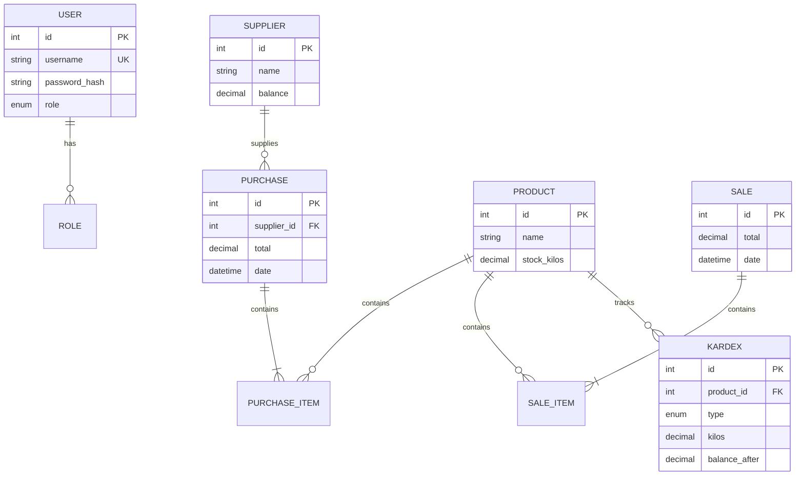

# 🏗️ Architecture Documentation

## System Overview

**Sistema de Compras, Ventas e Inventario** - MVP designed for inventory management with purchases, sales, suppliers, and kardex tracking.

### Tech Stack
- **Frontend**: React 18 + TypeScript + Tailwind CSS + Vite
- **Backend**: NestJS + TypeScript + Prisma ORM
- **Database**: PostgreSQL 15
- **Authentication**: JWT + bcrypt
- **Containerization**: Docker + Docker Compose

---

## 🎯 Architecture Pattern

### Monorepo Structure
```
inventory-system/
├── backend/     # NestJS API Server
├── frontend/    # React SPA
└── docker-compose.yml
```

### Backend Architecture (NestJS)
**Pattern**: Modular Architecture with Dependency Injection

```
src/
├── main.ts                 # Bootstrap
├── app.module.ts           # Root module
├── prisma/                 # Database layer
│   ├── prisma.module.ts
│   └── prisma.service.ts
├── auth/                   # Authentication
│   ├── auth.module.ts
│   ├── auth.service.ts
│   ├── auth.controller.ts
│   ├── strategies/
│   └── guards/
├── products/               # Products CRUD
├── suppliers/              # Suppliers CRUD
├── purchases/              # Purchase transactions
├── sales/                  # Sale transactions
└── kardex/                 # Movement history
```

**Key Principles**:
- Single Responsibility Principle
- Dependency Injection
- Module isolation
- Service layer for business logic
- Controller layer for HTTP handling

### Frontend Architecture (React)
**Pattern**: Component-Based with Centralized State

```
src/
├── main.tsx               # Entry point
├── App.tsx                # Router setup
├── pages/                 # Page components
│   ├── LoginPage.tsx
│   ├── Dashboard.tsx
│   ├── ProductsPage.tsx
│   ├── SuppliersPage.tsx
│   ├── PurchasesPage.tsx
│   ├── SalesPage.tsx
│   └── KardexPage.tsx
├── components/            # Reusable components
│   └── Layout/
│       └── DashboardLayout.tsx
├── services/              # API integration
│   └── api.ts
└── store/                 # Global state
    └── authStore.ts
```

**Key Principles**:
- Component composition
- Custom hooks
- Zustand for auth state
- Axios for API calls
- React Router for navigation

---

## 📊 Database Design

### Schema Overview



### Key Relationships
- **One-to-Many**: Supplier → Purchases
- **One-to-Many**: Purchase → PurchaseItems
- **One-to-Many**: Sale → SaleItems
- **One-to-Many**: Product → KardexEntries
- **Many-to-One**: Items → Product

### Data Integrity
- Foreign key constraints
- NOT NULL on critical fields
- Unique constraint on username
- Decimal precision for financial data

---

## 🔄 Data Flow

### Purchase Flow
```
User → Frontend → API → Service → Transaction:
                                   1. Create Purchase
                                   2. Create Items
                                   3. Update Stock (+)
                                   4. Create Kardex (IN)
                                   → Commit
```

### Sale Flow
```
User → Frontend → API → Service → Validation:
                                   - Check stock availability
                                   → Transaction:
                                     1. Create Sale
                                     2. Create Items
                                     3. Update Stock (-)
                                     4. Create Kardex (OUT)
                                     → Commit
```

### Authentication Flow
```
User → Login Form → POST /auth/login → Validate credentials
                                      → Generate JWT
                                      → Return token + user
Frontend → Store token → Add to headers → Protected routes
```

---

## 🔐 Security Architecture

### Authentication Layer
- **JWT Tokens**: 24h expiration
- **Password Hashing**: bcrypt with 10 rounds
- **Guards**: JwtAuthGuard, RolesGuard
- **Strategies**: LocalStrategy, JwtStrategy

### Authorization Matrix
```typescript
Roles:
- ADMIN: Full access (CRUD on all resources)
- SECRETARIA: Read + Create transactions (no edit on master data)
```

### Security Measures
1. **Input Validation**: class-validator on all DTOs
2. **SQL Injection**: Prisma parameterized queries
3. **CORS**: Configured for specific origin
4. **Helmet**: Security headers
5. **Rate Limiting**: (Future enhancement)

---

## 🚀 Deployment Architecture

### Docker Compose Setup
```yaml
Services:
  - postgres:5432    # Database
  - backend:3000     # API Server
  - frontend:80      # Nginx serving React build
```

### Container Communication
```
Frontend (Nginx) → Backend (NestJS) → PostgreSQL
     ↓
  Browser (localhost:5173)
```

### Environment Configuration
- **Development**: Local .env files
- **Production**: Environment variables injection
- **Database**: Connection pooling via Prisma

---

## 📦 Module Dependencies

### Backend
```
AppModule
├── ConfigModule (global)
├── PrismaModule (global)
├── AuthModule
│   ├── UsersModule
│   ├── JwtModule
│   └── PassportModule
├── ProductsModule
├── SuppliersModule
├── PurchasesModule
│   └── ProductsModule
├── SalesModule
│   └── ProductsModule
└── KardexModule
```

### Frontend
```
App
├── Router
├── AuthStore (Zustand)
├── API Service (Axios)
└── Pages
    ├── Layout (with navigation)
    └── Feature Pages
```

---

## 🧪 Testing Strategy

### Backend Testing
```
Unit Tests (*.spec.ts)
├── Service layer logic
├── Stock calculations
└── Validation rules

E2E Tests (*.e2e-spec.ts)
├── Authentication flow
├── Purchase creation
└── Sale with stock validation
```

### Test Coverage Goals
- Services: >80%
- Controllers: >70%
- Critical paths: 100% (stock updates, kardex)

---

## 📈 Scalability Considerations

### Current MVP Limitations
- Single database instance
- No caching layer
- Synchronous operations
- In-memory session storage

### Future Enhancements
1. **Horizontal Scaling**: Load balancer + multiple backend instances
2. **Caching**: Redis for frequently accessed data
3. **Queue System**: Bull/RabbitMQ for async operations
4. **Database**: Read replicas, connection pooling
5. **CDN**: Static asset delivery
6. **Monitoring**: Prometheus + Grafana

---

## 🔍 Observability

### Logging Strategy
```typescript
Development:
- Console logs with colors
- Detailed error traces

Production:
- Structured JSON logs
- Winston/Pino integration
- Log aggregation (ELK stack)
```

### Monitoring Points
- API response times
- Database query performance
- Error rates
- Stock discrepancies
- User activity

---

## 🛠️ Development Workflow

### Local Development
```bash
# Terminal 1: Database
docker-compose up postgres

# Terminal 2: Backend
cd backend
npm run start:dev

# Terminal 3: Frontend
cd frontend
npm run dev
```

### Testing Workflow
```bash
# Unit tests
npm run test

# E2E tests
npm run test:e2e

# Watch mode
npm run test:watch
```

### Deployment Workflow
```bash
# Build images
docker-compose build

# Start all services
docker-compose up -d

# View logs
docker-compose logs -f
```

---

## 📚 Design Patterns Used

### Backend
- **Module Pattern**: NestJS modules
- **Dependency Injection**: Services
- **Repository Pattern**: Prisma as data layer
- **Strategy Pattern**: Passport strategies
- **Guard Pattern**: Authorization guards
- **DTO Pattern**: Data validation
- **Transaction Pattern**: Database atomicity

### Frontend
- **Container/Presenter**: Smart vs presentational components
- **Custom Hooks**: Reusable logic
- **Service Layer**: API abstraction
- **State Management**: Zustand store
- **Route Guards**: Protected routes

---

## 🎯 Performance Optimization

### Backend
- Prisma query optimization
- SELECT only needed fields
- Include relations efficiently
- Connection pooling
- Response compression (gzip)

### Frontend
- Code splitting (Vite)
- Lazy loading routes
- Debounced API calls
- Memoization (React.memo)
- Optimistic UI updates

### Database
- Indexed foreign keys
- Efficient query patterns
- No N+1 queries
- Transaction optimization

---

## 🔄 CI/CD Pipeline (Future)

```
Git Push → GitHub Actions:
           1. Run tests
           2. Build Docker images
           3. Push to registry
           4. Deploy to staging
           5. Run E2E tests
           6. Deploy to production
```

---

## 📝 API Design Principles

1. **RESTful**: Standard HTTP methods
2. **Consistent**: Same patterns across endpoints
3. **Versioned**: `/api` prefix (future: `/api/v1`)
4. **Documented**: OpenAPI/Swagger ready
5. **Error Handling**: Consistent error format
6. **Validation**: Request/response validation

---

## 🏆 Best Practices Implemented

### Code Quality
- ✅ TypeScript strict mode
- ✅ ESLint configuration
- ✅ Prettier formatting
- ✅ Git hooks (recommended)
- ✅ Meaningful naming

### Security
- ✅ Environment variables
- ✅ No secrets in code
- ✅ Input validation
- ✅ SQL injection prevention
- ✅ XSS protection

### Maintainability
- ✅ Modular architecture
- ✅ Clear folder structure
- ✅ Comprehensive documentation
- ✅ Type safety
- ✅ Error boundaries

---

## 🚀 Production Checklist

Before deploying to production:

- [ ] Change JWT_SECRET
- [ ] Update database credentials
- [ ] Configure HTTPS/SSL
- [ ] Set up database backups
- [ ] Configure CORS for production domain
- [ ] Enable rate limiting
- [ ] Set up monitoring
- [ ] Configure logging
- [ ] Update default user passwords
- [ ] Run security audit
- [ ] Load testing
- [ ] Disaster recovery plan

---

## 📖 Further Reading

- [NestJS Documentation](https://docs.nestjs.com/)
- [Prisma Documentation](https://www.prisma.io/docs/)
- [React Documentation](https://react.dev/)
- [PostgreSQL Best Practices](https://www.postgresql.org/docs/)

---

**Architecture designed for scalability, maintainability, and security.** 🏗️
